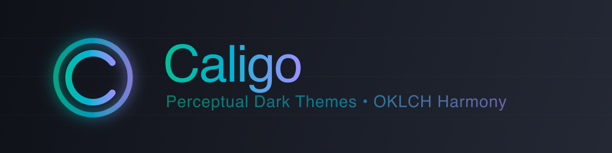

<p align="center">
  
</p>

<h1 align="center">Caligo</h1>

<p align="center">
  <strong>50 perceptually uniform dark themes built on OKLCH color science</strong><br>
  10 seed palettes × 5 harmony modes
</p>

<p align="center">
  <a href="https://marketplace.visualstudio.com/items?itemName=AnselmHahn.caligo-vscode-theme"><strong>Install</strong></a>
  · <a href="https://anselmoo.github.io/caligo-vscode-theme/#/"><strong>Live Preview</strong></a>
  · <a href="https://anselmoo.github.io/caligo-vscode-theme/#/gallery"><strong>Gallery</strong></a>
  · <a href="CONTRIBUTING.md"><strong>Contribute</strong></a>
  · <a href="QUICKSTART.md"><strong>Quick Start</strong></a>
</p>

<p align="center">
  <a href="https://marketplace.visualstudio.com/items?itemName=AnselmHahn.caligo-vscode-theme">
    
  </a>
  <a href="https://marketplace.visualstudio.com/items?itemName=AnselmHahn.caligo-vscode-theme">
    
  </a>
  <a href="LICENSE">
    
  </a>
  <a href="https://github.com/Anselmoo/caligo-vscode-theme/actions/workflows/cicd.yml">
    
  </a>
</p>

---

## ✨ Features

- **50 themes** from 10 seed palettes × 5 color harmonies
- **OKLCH color science** — perceptually uniform, mathematically derived colors
- **High contrast** — designed with accessibility in mind using APCA-W3 contrast validation
- **Semantic highlighting** — intent-aware colors for declarations, mutations, control flow
- **Consistent syntax** — harmonized bracket pairs, git diff, and terminal colors

## 📦 Installation

1. Open **Extensions** (`Cmd+Shift+X` / `Ctrl+Shift+X`)
2. Search for **"Caligo"**
3. Click **Install**
4. Open Command Palette → **Preferences: Color Theme** → Select any Caligo theme

Or from command line:
```bash
code --install-extension AnselmHahn.caligo-vscode-theme
```

## 🖼️ Theme Gallery

<p align="center">
  
</p>

<table>
<tr>
<td align="center" width="33%">

<br><strong>Aurora Noir</strong>
</td>
<td align="center" width="33%">

<br><strong>Eclipse</strong>
</td>
<td align="center" width="33%">

<br><strong>Mandarian</strong>
</td>
</tr>
</table>

<p align="center">
  <a href="https://anselmoo.github.io/caligo-vscode-theme/#/gallery"><strong>→ Browse all 50 themes</strong></a>
</p>

### Seed Palettes

| Palette              | Character                              |
| -------------------- | -------------------------------------- |
| **Aurora Noir**      | Cyan-teal aurora over deep ocean       |
| **Cinder**           | Warm amber glow from smoldering embers |
| **Deep Sable**       | Rich earth tones with deep warmth      |
| **Eclipse**          | Solar corona against void black        |
| **Graphite Flux**    | Industrial steel with electric accents |
| **Mandarian**        | Vibrant citrus energy                  |
| **Midnight Atelier** | Artist's studio at night               |
| **Nebula Night**     | Cosmic dust and starlight              |
| **Obsidian Glow**    | Volcanic glass with inner fire         |
| **Void Ember**       | Smoldering darkness                    |

Each palette has 5 harmony variants: **Balanced**, **Analogous**, **Triadic**, **Split-Complementary**, **Monochromatic**

## 🔬 Why OKLCH?

Traditional themes use hand-picked hex codes. Caligo uses **OKLCH** — a perceptually uniform color space where:

- Colors at equal lightness *look* equally bright
- Harmony transformations preserve readability
- Contrast ratios are predictable

> *"Colors that look equally different, are equally different."*

## 🎯 Semantic Highlighting

Beyond syntax colors, Caligo includes intent-based highlighting:

| Intent       | Purpose       | Examples                     |
| ------------ | ------------- | ---------------------------- |
| Declaration  | Definitions   | `const`, `function`, `class` |
| Mutation     | State changes | `=`, `++`, `--`              |
| Control Flow | Logic         | `if`, `for`, `return`        |
| Data         | Values        | Literals, constants          |

*Requires language server support (TypeScript, Python/Pylance, Rust, etc.)*

---

## 📚 More Info

- [**Web Gallery**](https://anselmoo.github.io/caligo-vscode-theme/) — Interactive theme browser
- [**Contributing**](CONTRIBUTING.md) — Development setup & guidelines
- [**Quick Start**](QUICKSTART.md) — Developer quick start guide

<br>

<div align="center">
  <hr>
  <br>
  <p>
    &copy; 2026 Anselm Hahn. MIT Licensed.
  </p>
  <p>
    Built with ❤️ for developers who code after dark 🌙
  </p>
  <p>
    <a href="https://marketplace.visualstudio.com/items?itemName=AnselmHahn.caligo-vscode-theme">Marketplace</a> •
    <a href="https://github.com/Anselmoo/caligo-vscode-theme">GitHub</a> •
    <a href="https://anselmoo.github.io/caligo-vscode-theme/#/gallery">Gallery</a> •
    <a href="CONTRIBUTING.md">Contributing</a> •
    <a href="LICENSE">License</a>
  </p>
</div>
